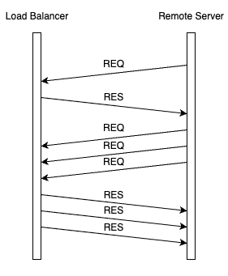

## BALANCE HUB 
----------------------------------------------------------------

   

A Reverse Proxy that distributes load across various configured remote servers AKA an HTTP Load Balancer

### Configuration 
[`config.yml`](./config.yaml) is used to configure the server

* `Original-server` : Refers to Remote Server across which load has to be distributed.
    * `allow`: This is a list of subnets to whitelist original servers. By default deny rules are applied to all servers.
* `BalanceHub`: This follows the actual configuration of the load balancer
    * `listen` : Port to listen on
    * `tcpListener` : TCP port to listen for remote server requests
    * `protocol` : HTTP or HTTPS
    * `ssl_certificate` :  /path/to/cert
    * `ssl_certificate_key` : /path/to/key
    * `algorithm` : "Least-connected"
    * `access-logs-path` : /path/to/log
    * `db-path` : /path/to/sqlite/db
    * `redis-server` : Used for caching and logging if available
        * `ip`: The IP address
        * `port` : The port
        * `db` : The database id
        * `caching` : Set to true to enable request caching
        * `cache-duration`: duration in seconds
    
### Dynamic Configuration of Original Servers

Remote servers can be dynamically configured by sending custom tcp based request packets to the load balancer. 

#### Packet Structure

###### 1. Request Packet 
* <b>Protocol</b>: `LB`
* <b>Action</b>: 
    * `0xF0` &rarr; Add
    * `0x0F` &rarr; Remove

* <b>Payload</b>:
    ```
    {
        "Port": "8085", (optional | defaults to the port which sent the request)
        "Paths": [
            "path1",
            "path2",
            ...
        ],
        "Clients": [
            "client1",
            "client2",
            ...
        ]
    }
    ```
    

    ***Note:***
    > The `0xF0` Action byte sets up the remote server in the load balancer, defining specific paths and clients. When no paths/clients are specified, the load balancer automatically whitelists all clients and paths.
    
    > The `0x0F` Action byte allows for selectively unconfiguring paths/clients in the load balancer. If no paths are specified, it removes the server entirely from load balancing. 

    <!-- >Note: If paths are not specified then all the clients will be whitelisted -->

###### 2. Response Packet 
* <b>Protocol</b>: `RE`
* <b>Action</b>: 
    * `0xFF` &rarr; Success
    * `0x00` &rarr; Failure

* <b>Payload</b>: `string`


### Communication

The Load Balancer is capable of processing multiple remote request packets in a single connection.



***Note:***
>The default TTL is set to 10 seconds


### Building 

To build and run the project, run the following commans in the project directory
* Build the project :
    ```
    ./build build
    ```
* Run the project (_Builds the project and runs if not already built_) :
    ```
    ./build run
    ```
* Force build the project (_Deletes old build and rebuilds_) :
    ```
    ./build force_build
    ```

If using docker,
```
./build --dockerbuild
```
