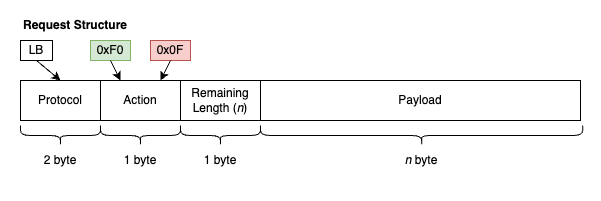
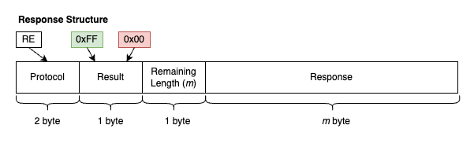

## BALANCE HUB 
----------------------------------------------------------------

   

A Reverse Proxy that distributes load across various configured remote servers AKA an HTTP Load Balancer

### Configuration 
[`config.yml`](./config.yaml) is used to configure the server

* `Original-server` : Refers to Remote Server across which load has to be distributed.
    * `allow`: This is a list of subnets to whitelist original servers. By default deny rules are applied to all servers.
* `BalanceHub`: This follows the actual configuration of the load balancer
    * `listen` : Port to listen on
    * `protocol` : HTTP or HTTPS
    * `ssl_certificate` :  /path/to/cert
    * `ssl_key` : /path/to/key
    * `algorithm` : "Least-connected"
    * `access-logs-path` : /path/to/log
    * `db-path` : /path/to/sqlite/db
    * `redis-server` : Used for caching and logging if available
        * `ip`: The IP address
        * `port` : The port
        * `db` : The database id
        * `password` : The password
        * `caching` : Set to true to enable request caching
        * `cache-duration`: duration in seconds
    
### Dynamic Configuration of Original Servers


### Packet Structure




#### Structures

###### Request Structure 
* <b>Protocol</b>: `LB`
* <b>Action</b>: 
    * `0xF0` &rarr; Add
    * `0x0F` &rarr; Remove

* <b>Payload</b>:
    ```
    {
        "Port": "8085", (optional | defaults to the port which sent the request)
        "Paths": [
            "path1",
            "path2",
            ...
        ],
        "Clients": [
            "client1",
            "client2",
            ...
        ]
    }
    ```
    <!-- >Note: If paths are not specified then all the clients will be whitelisted -->

###### Response Structure 
* <b>Protocol</b>: `RE`
* <b>Action</b>: 
    * `0xFF` &rarr; Success
    * `0x00` &rarr; Failure

* <b>Payload</b>: `string`
